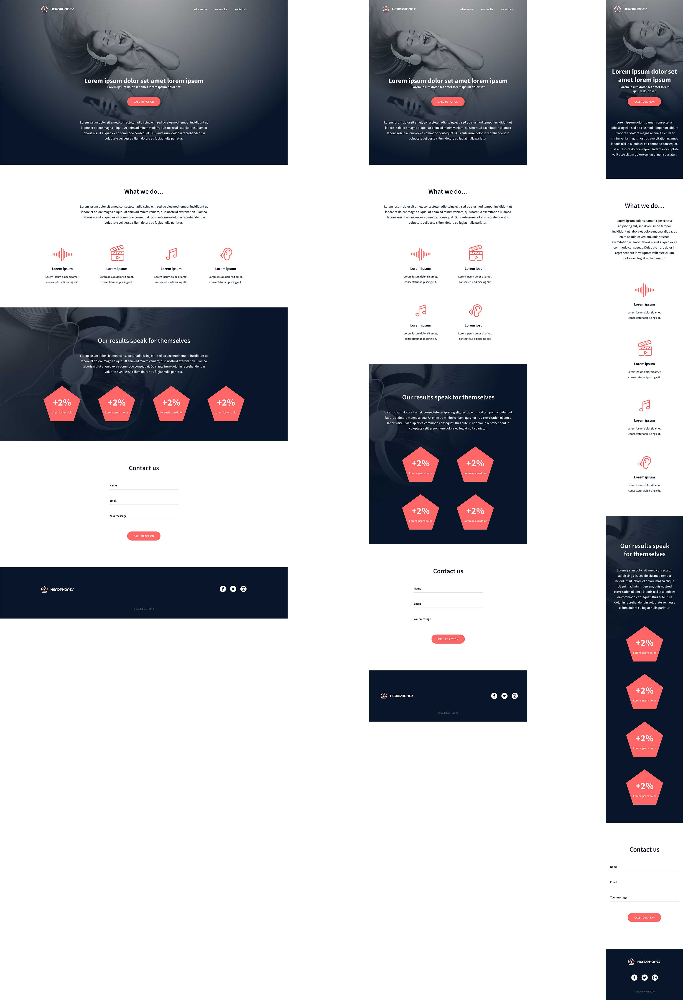

# 🎧 Holberton Headphones



## Description

This project consists of building a fully responsive web page from scratch using only HTML and CSS, based on a Figma design created by a UI/UX designer. The goal is to accurately reproduce the visual layout, typography, spacing, and responsiveness without using any external CSS frameworks or JavaScript. Emphasis is placed on clean structure, accessibility, and pixel-perfect design implementation.

The webpage adapts seamlessly between desktop and mobile views, ensuring a smooth user experience across devices. Special attention is given to hover states, layout constraints, and responsive behavior as defined in the project specifications.

---

## Features

- Fully responsive design (mobile version at ≤ 480px)
- Pure HTML & CSS (no JavaScript, no frameworks)
- Pixel-perfect implementation based on Figma
- Accessibility best practices
- Clean and maintainable code structure
- Centered layout with a maximum width of 1000px

---

## Design Details

- **Fonts used**:
  - Source Sans Pro
  - Spin Cycle OT

- **Interactions**:
  - Links hover/active color: `#FF6565`
  - Buttons hover/active: `opacity: 0.9`

- **Layout constraints**:
  - Max content width: `1000px`
  - Content centered horizontally

- **Responsive behavior**:
  - Mobile layout triggered at screen width ≤ `480px`

---

## Project Structure
holbertonschool-headphones/

│
├── index.html
├── styles/
│ └── styles.css
├── images/
└── README.md


---

## Setup Instructions

1. Clone the repository:
   ```bash
   git clone https://github.com/your-username/holbertonschool-headphones.git

## Objectives
Practice HTML semantic structure
Master CSS layout techniques (Flexbox, positioning, responsiveness)
Translate Figma designs into real web pages
Build without relying on external libraries
Improve attention to detail and UI precision

## Responsive Preview

The website automatically adapts to smaller screens, providing an optimized mobile layout for better usability and readability.

## Author

Malik BOUANANI
Holberton School